# Guide d'administration — Cultur'all

Ce guide décrit, pas à pas, comment utiliser l'administration du site pour
gérer le **contenu visible par les visiteurs**. Il se concentre sur les
**Fragments** : ce sont les briques de contenu réutilisables qui alimentent la
page d'accueil, la page Blog, la page Projets et la section Réseau.

> Les captures d'écran de ce guide ont été prises sur une instance de
> développement avec un jeu de données d'exemple.

---

## 1. Accès à l'administration

### 1.1. URL et connexion

| Environnement | URL d'administration                       |
| ------------- | ------------------------------------------ |
| Local (dev)   | `http://localhost:8000/admin/`             |
| Préprod       | `https://preprod.cultur-all.com/admin/`    |
| Production    | `https://cultur-all.com/admin/`            |

1. Ouvrez l'URL d'administration dans votre navigateur.
2. Saisissez votre **identifiant** et votre **mot de passe** (compte créé par
   un administrateur via `manage.py createsuperuser`).
3. Cliquez sur **Se connecter**.

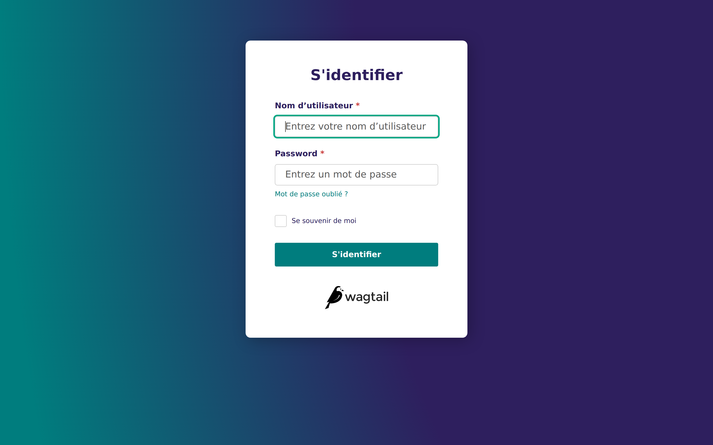

### 1.2. Tableau de bord

Après connexion, vous arrivez sur le tableau de bord Wagtail. Le menu
vertical à gauche donne accès aux sections **Pages**, **Images**,
**Contacts**, **Documents**, **Fragments**, **Rapports**, **Paramètres** et
**Aide**.

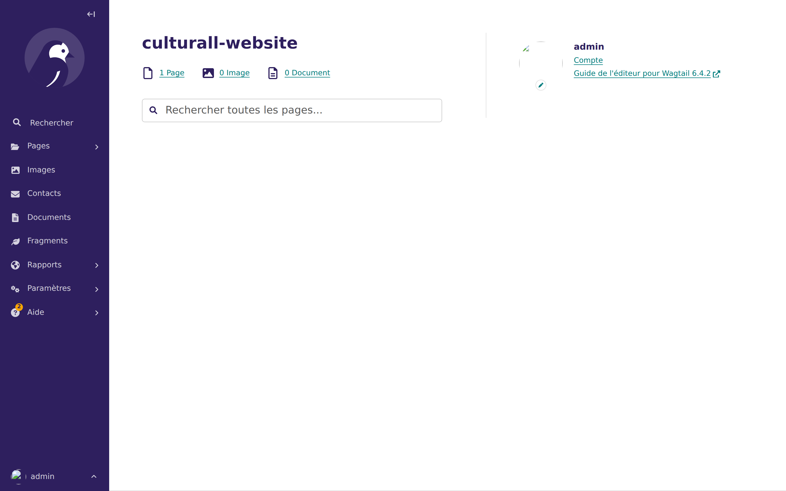

---

## 2. Comprendre les « Fragments »

Les **Fragments** sont les contenus réutilisables affichés sur le site public.
On y accède via l'entrée **Fragments** du menu latéral.

| Fragment                | Où il s'affiche sur le site                                     |
| ----------------------- | --------------------------------------------------------------- |
| **Articles**            | Page `/blog` + carrousel en page d'accueil                      |
| **Projets**             | Page `/projets` + section « Les projets à la une » (accueil)    |
| **Membres du réseau**   | Section « Notre Réseau » en page d'accueil                      |
| **Demandes de contact** | **Lecture seule** — soumissions du formulaire de contact (aussi accessibles via l'entrée **Contacts** du menu principal) |

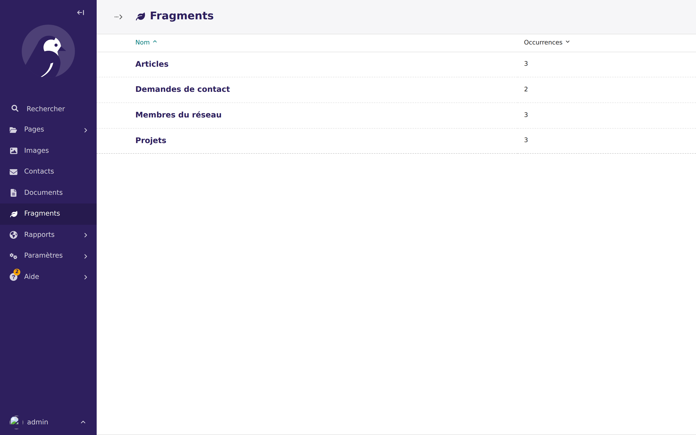

> **Règle générale** : dès qu'un fragment est **publié / enregistré sans
> brouillon**, il est immédiatement visible côté site (pas de cache long).
> Relisez-vous avant de cliquer sur le bouton de publication.

---

## 3. Articles (Blog)

### 3.1. Créer un article

1. Menu latéral → **Fragments** → **Articles**.
2. Cliquez sur **Ajouter un(e) Article** (bouton en haut à gauche).
3. Remplissez le formulaire :

| Champ             | Obligatoire | Description                                                                |
| ----------------- | :---------: | -------------------------------------------------------------------------- |
| **Titre**         |      ✅      | Titre affiché dans la carte et en tête de l'article (max. 255 caractères). |
| **Tags**          |      ❌      | Séparés par des virgules. Permettent le filtrage sur la page Blog.         |
| **Résumé**        |      ❌      | Court texte affiché dans la carte de l'article.                            |
| **Contenu**       |      ✅      | Éditeur de texte riche (gras, titres, listes, liens, images, etc.).        |
| **Illustration**  |      ❌      | Image affichée dans la carte (recadrée en 800×500).                        |

4. Deux choix au bas de la page :
   - **Enregistrer le brouillon** (bouton principal, vert) : l'article est
     sauvegardé mais **n'apparaît pas encore sur le site**.
   - Cliquez sur la flèche ▲ à droite du bouton pour ouvrir le menu
     d'actions, puis **Publier** pour rendre l'article visible sur le site.

> ℹ️ Les articles utilisent un système de **brouillon / publié**
> (`DraftStateMixin`). Tant qu'ils ne sont pas explicitement publiés, ils
> restent invisibles du public.

### 3.2. Modifier, publier ou supprimer un article

- **Modifier** : dans la liste Articles, cliquez sur le titre de l'article.
  Après modification, **Enregistrer le brouillon** ou **Publier**.
- **Dépublier** : menu ▲ → **Dépublier** (retire l'article du site sans le
  supprimer).
- **Supprimer** : menu **Actions** en haut → **Supprimer**, puis confirmez.
- **Historique** : onglet **Historique** pour voir et restaurer une
  révision précédente (Wagtail en conserve une à chaque enregistrement).

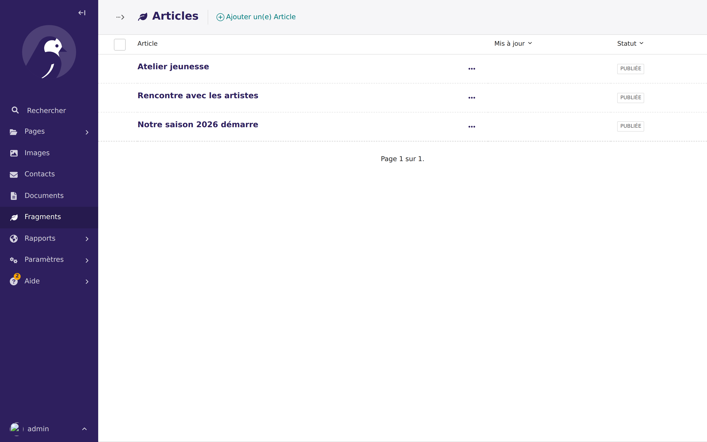

La colonne **Statut** de la liste indique `PUBLIÉE`, `BROUILLON` ou les deux
(article publié avec un brouillon en attente).

### 3.3. Où l'article apparaît sur le site

- **Page `/blog`** : tous les articles **publiés**, triés du plus récent au
  plus ancien, avec filtres par tag.
- **Page d'accueil** : carrousel des **5 articles publiés les plus récents**.

---

## 4. Projets

### 4.1. Créer un projet

1. **Fragments** → **Projets** → **Ajouter un(e) Projet**.
2. Remplissez :

| Champ              | Obligatoire | Description                                                             |
| ------------------ | :---------: | ----------------------------------------------------------------------- |
| **Titre**          |      ✅      | Nom du projet.                                                          |
| **Description**    |      ❌      | Texte riche affiché dans la fiche détail.                               |
| **Tags**           |      ❌      | Catégories, filtrables sur la page Projets.                             |
| **Lien YouTube**   |      ✅      | URL complète YouTube. L'ID vidéo est extrait automatiquement.           |
| **Miniature**      |      ❌      | Image affichée dans la grille (recadrée en 600×400).                    |
| **À la une**       |      ❌      | Case à cocher : promeut le projet en page d'accueil (**max. 3**).       |

3. Cliquez sur **Enregistrer** : le projet est immédiatement visible sur le
   site (pas de mécanisme de brouillon pour les projets).

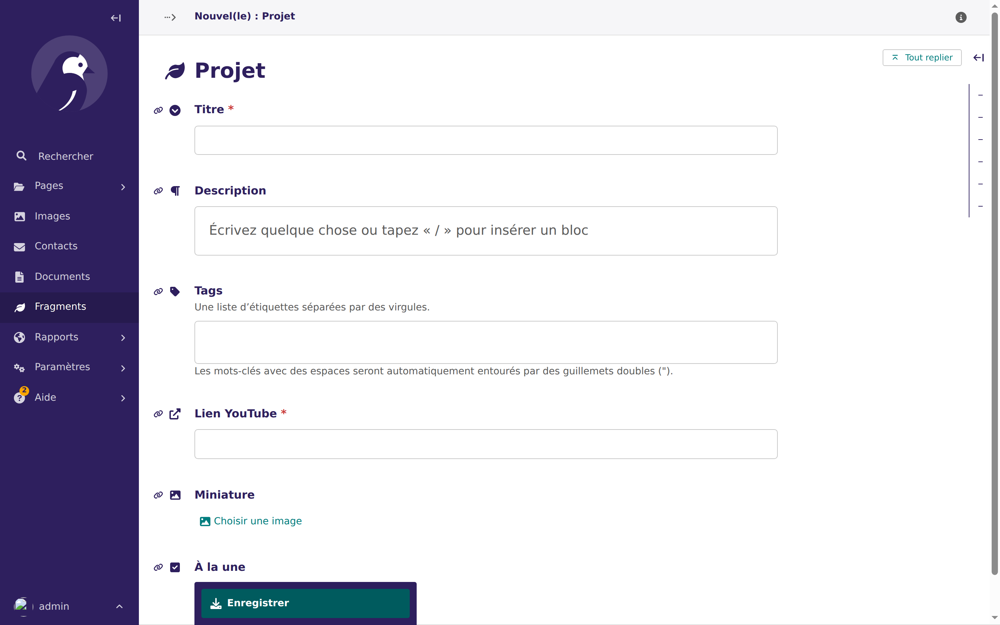

### 4.2. Mettre des projets à la une

La page d'accueil affiche la section **« Les projets à la une »**. Pour y
mettre un projet, cochez **À la une** dans la fiche projet.

> ⚠️ **Limite stricte : 3 projets à la une maximum.**
> Si vous cochez la case sur un 4ᵉ projet, l'enregistrement échoue avec le
> message **« Il ne peut y avoir plus de 3 projets à la une. »** affiché
> juste sous la case. Décochez d'abord la case sur un projet existant.

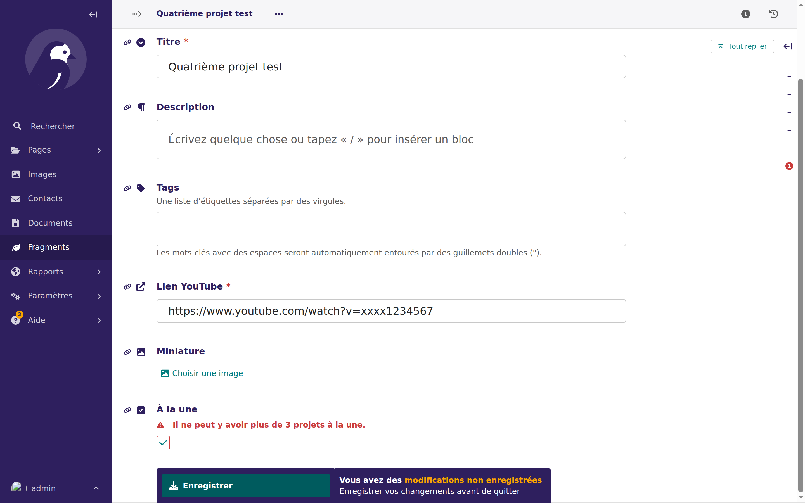

Le même message s'affiche aussi en bandeau rouge en haut du formulaire :

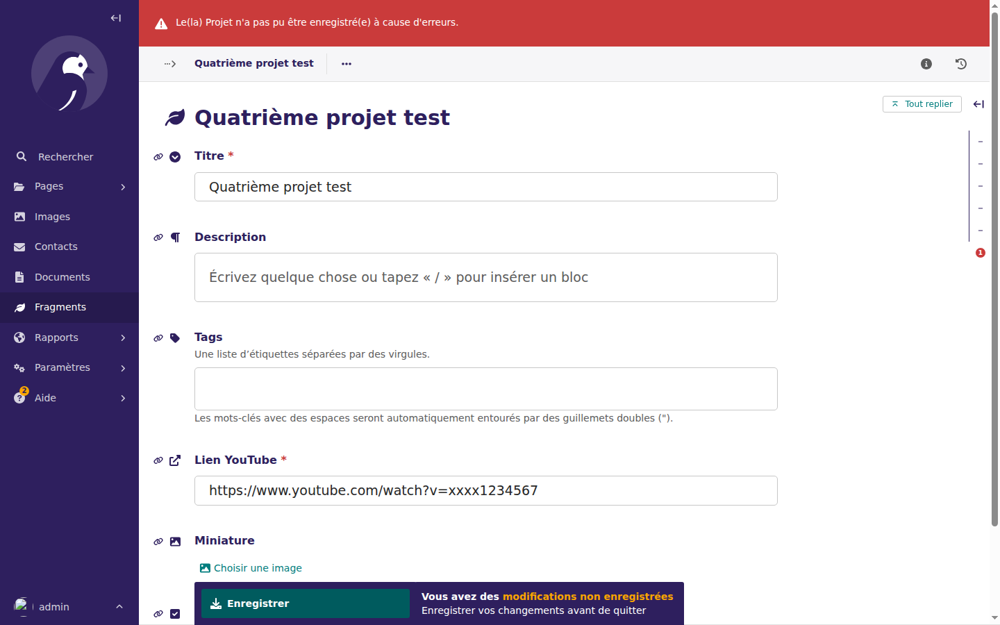

### 4.3. Où le projet apparaît

- **Page `/projets`** : grille 3 colonnes de tous les projets (filtres par tag).
- **Page d'accueil** : section *« Les projets à la une »* — uniquement les
  projets cochés *À la une*.
- **Détail** : clic sur un projet → superposition (overlay) avec la
  description et la vidéo YouTube intégrée.

---

## 5. Membres du réseau

### 5.1. Ajouter un membre

1. **Fragments** → **Membres du réseau** → **Ajouter un(e) Membre du
   réseau**.
2. Remplissez :

| Champ     | Obligatoire | Description                                                                     |
| --------- | :---------: | ------------------------------------------------------------------------------- |
| **Nom**   |      ✅      | Nom de l'organisation.                                                          |
| **Type**  |      ✅      | Catégorie libre (ex. *Partenaire*, *Sponsor*, *Collectivité*, *Collaborateur*). |
| **Logo** |      ❌      | Image du logo (redimensionnée au max. 200×200).                                 |

3. **Enregistrer**.

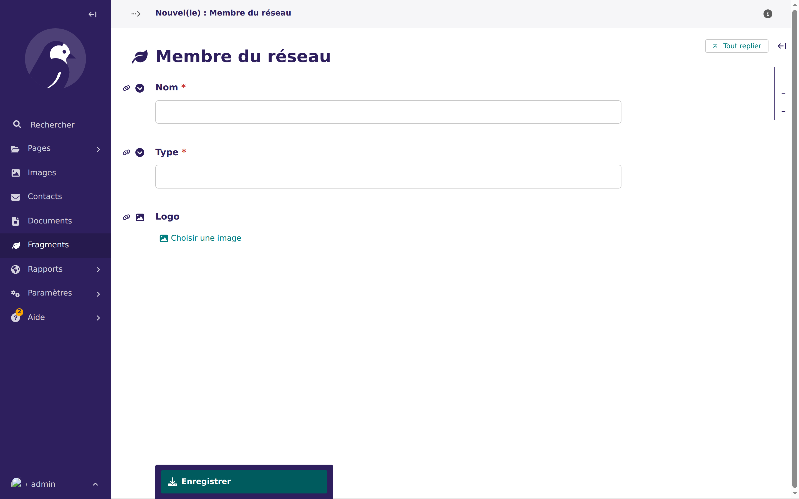

### 5.2. Comprendre le champ « Type »

- Le champ **Type** est un texte libre.
- Les **boutons de filtre** visibles en page d'accueil (section Réseau) sont
  générés **automatiquement** à partir des valeurs uniques saisies dans ce
  champ.
- **Attention à la cohérence** : `"Partenaire"`, `"partenaire"` et
  `"Partenaires"` produiront **trois boutons distincts**. Privilégiez un
  vocabulaire figé (documentez-le ailleurs si besoin).

### 5.3. Rendu sans logo

Si aucun logo n'est téléversé, le site affiche le **nom** du membre en texte.
C'est fonctionnel mais moins visuel — ajoutez toujours un logo si possible.

---

## 6. Contacts (soumissions du formulaire)

### 6.1. Consultation

Les demandes de contact sont accessibles de deux façons :
- Menu latéral → **Contacts** (raccourci direct).
- Menu latéral → **Fragments** → **Demandes de contact**.

La liste affiche **Sujet**, **Nom**, **Email**, **Date de soumission**.
Cliquez sur une ligne pour lire le message complet.

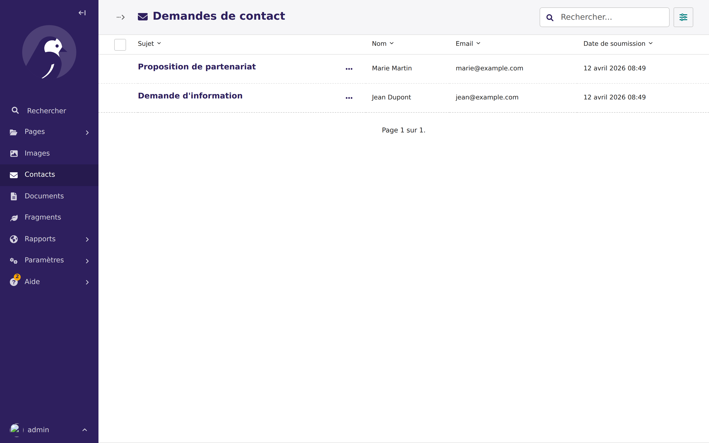

### 6.2. Limitations

- **Création impossible** : les soumissions arrivent uniquement via le
  formulaire public `/contact` du site.
- **Édition impossible** : tous les champs sont en lecture seule.
- **Suppression impossible** : les messages sont archivés de façon permanente.
- **Recherche** disponible sur Nom, Email, Sujet, Message.

> Pour répondre à un contact, utilisez votre client mail habituel (l'adresse
> est affichée dans la fiche).

---

## 7. Images (Bibliothèque médias)

Les images utilisées dans les Articles, Projets et Membres du réseau sont
stockées dans la **bibliothèque Images** de Wagtail (menu latéral **Images**).

- **Téléverser** : bouton **Ajouter une image**. Les images sont stockées sur
  le bucket MinIO/S3 du projet.
- **Éditer** : modifier le titre, le texte alternatif (accessibilité), le
  point focal pour les recadrages.
- **Réutiliser** : une même image peut être référencée par plusieurs
  fragments.

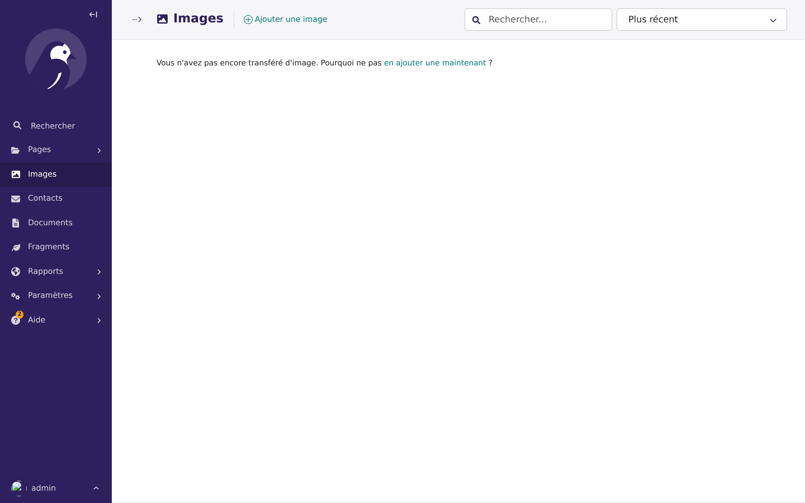

> ⚠️ **Ne supprimez pas une image encore utilisée** par un article/projet :
> l'illustration ou la miniature sera manquante côté site. Vérifiez d'abord
> les usages dans l'onglet *Usage* de la fiche image.

---

## 8. Paramètre d'accès au site

Le site peut être placé **derrière une authentification publique** (utile en
phase de préprod). Ce réglage se fait dans :

**Paramètres** → **Paramètres du site** → case **Authentification requise**.

| Valeur              | Effet côté visiteur                                                  |
| ------------------- | -------------------------------------------------------------------- |
| **Cochée** (défaut) | Toute page non-API redirige vers `/login` si l'utilisateur n'est pas connecté. |
| **Décochée**        | Le site est public, aucun login demandé.                             |

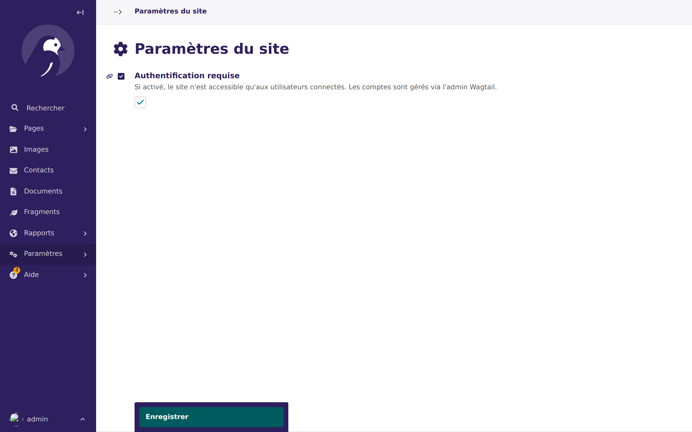

> Ce réglage n'a pas d'impact sur l'accès à `/admin/` : l'admin est toujours
> protégé par ses propres identifiants.

---

## 9. Tableau récapitulatif : où modifier quoi ?

| Ce que je vois sur le site                 | Où le modifier dans l'admin                   |
| ------------------------------------------ | --------------------------------------------- |
| Carrousel blog (accueil)                   | Fragments → Articles *(5 plus récents publiés)* |
| Page `/blog`                               | Fragments → Articles                          |
| Section « Les projets à la une »           | Fragments → Projets — case *À la une*         |
| Page `/projets`                            | Fragments → Projets                           |
| Section « Notre Réseau » (accueil)         | Fragments → Membres du réseau                 |
| Filtres Partenaires / Sponsors / etc.      | Fragments → Membres du réseau, champ *Type*   |
| Messages reçus via le formulaire contact   | Contacts *(lecture seule)*                    |
| Site public ou protégé par login           | Paramètres → Paramètres du site               |
| Illustrations utilisées partout            | Images (menu latéral)                         |

---

## 10. Bonnes pratiques

- **Prévisualisez** avant d'enregistrer : utilisez l'onglet *Prévisualiser*
  de l'éditeur d'article quand il est disponible.
- **Soignez les tags** : ils pilotent les filtres publics ; une faute de
  frappe crée une nouvelle catégorie visible par les visiteurs.
- **Nommez vos images** : un titre descriptif facilite la recherche dans la
  bibliothèque médias.
- **Renseignez le texte alternatif** (alt) de chaque image pour
  l'accessibilité et le SEO.
- **Vérifiez le rendu** sur le site public après chaque modification
  importante (ouvrez le site en navigation privée).
- **Limitez-vous à 3 projets « À la une »** et choisissez-les pour la vitrine
  de la page d'accueil.

---

## 11. Dépannage rapide

| Symptôme                                                   | Cause probable & solution                                                                                    |
| ---------------------------------------------------------- | ------------------------------------------------------------------------------------------------------------ |
| Un article créé n'apparaît pas sur `/blog`.                | L'article est en *Brouillon*. Ouvrez-le → menu ▲ → **Publier**.                                              |
| L'image d'un article est absente.                          | L'image a été supprimée de la bibliothèque. Rouvrez l'article et sélectionnez une nouvelle illustration.     |
| Impossible de cocher un 4ᵉ projet « À la une ».            | Limite de 3 atteinte. Décochez la case sur un projet existant avant de recocher sur le nouveau.              |
| Un nouveau bouton de filtre apparaît dans la section Réseau. | Une nouvelle valeur de *Type* a été saisie. Corrigez l'orthographe dans la fiche membre concernée.           |
| La vidéo d'un projet ne se lance pas.                      | URL YouTube mal formée. Copiez l'URL complète depuis la barre d'adresse YouTube (format `youtube.com/watch?v=…`). |
| Le site redirige tout le monde vers `/login`.              | *Authentification requise* est cochée. Paramètres → Paramètres du site → décochez.                           |

---

*Dernière mise à jour : 2026-04-12.*
